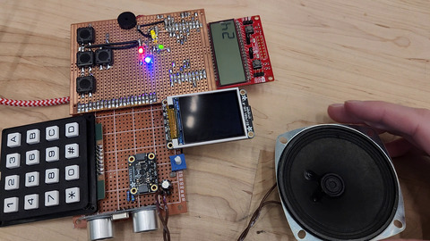

# Bad Apple on MSP430
[</img>](https://www.youtube.com/watch?v=TggQ8r52Djg)
[</img>](https://www.youtube.com/watch?v=TggQ8r52Djg)

This is a silly little project to get the MSP430FR6989, a microcontroller we had to use for a class ([ECE447](https://people-ece.vse.gmu.edu/~jkaps/courses/ece447-f20/index.html)) and that's intended to be used for ultra low-power metering or deeply embedded applications, to play a full 30 FPS video and produce reasonable quality audio in real time.  

This project somehow uses *no* external libraries (I didn't write lcd.h, lcd.c, or msp430fr6989.h, but they're all relatively simple and fully included in this repo), and manages to read, decode, and display each frame in about 24ms.  By making heavy use of the DMA peripheral, especially with background DMAs, it's able to get the frame display done so fast that there's still time for 10ms of low-power sleep mode each frame :)

## Why
 - It's fun to put bad apple in places where it shouldn't be
 - Fun to finally code everything from the ground up, zero libraries that I didn't write
 - Anemic microcontroller forced me to make optimizations that wouldn't have been necessary on e.g. an ESP32
 - Opportunity to use a bunch of new things (DMA, direct register SPI, SD card driver, display driver, were all things I'd never done before)

## How do it do
You can read `main.c` if you're *really* curious about how everything works (it's only 300 lines!), but here's a list of the more notable optimizations I had to make:
 - CPU runs at 16 MHz instead of the default 1 MHz
 - Audio is made by running TA1.2 at 250 kHz, then adjusting the duty cycle on a 44.1 kHz schedule (the speaker acts as an all-in-one lowpass filter, leaving only the 44.1 kHz audio signal)
 - Audio samples are loaded in via DMA in the background - TimerB triggers each new sample to be loaded.
 - SD card block reads are done via a blocking DMA transfer (this could be optimized further to be done during the frame-decoding phase)
 - The function that performs the frame decoding gets moved to SRAM for faster execution (functions are in FRAM by default, which can only be accessed at 8 MHz, but SRAM runs at full speed)
 - Decoded display lines are DMA'd out in the background while decoding the next line.

## How do I run it??
Wow I'm impressed you have an MSP430 *and* all of the required peripherals??

To run it, just open the git repo in Code Composer Studio and hit "debug" and then continue execution from the debugger.  That should be enough to get it going, but just in case you have to remake the project: make sure to set the optimization level to -O4 - without it, the decoder is too slow and the audio will have problems playing.
